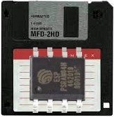

# ESP32-PsRamFS

[](https://www.ardu-badge.com/ESP32-PSRamFS)
[](https://registry.platformio.org/packages/libraries/tobozo/ESP32-PSRamFS)





Coding Horror
-------------

ESP32-PsRamFS id a pseudo RamDisk library for Arduino-ESP32, with vfs compliance.

It provides a `fs::FS` style filesystem using the psram of an ESP32-Wrover or any ESP32 equipped with PSRam.

Some unit tests are available in the example folder, consider setting the debug output level
to DEBUG to see what's happening.

Directory support is still partial but the API is now vfs compliant.

Usage
-----

Only use this if your situation *requires* a filesystem, otherwise consider dropping the
filesystem and use Streams instead with the excellent [arduino-BufferStream](https://github.com/IndustrialShields/arduino-BufferStream) library.


```C

#include <PSRamFS.h>


void setup()
{

  Serial.begin(115200);

  PSRamFS.setPartitionSize( ESP.getFreePsram()/2 ); // use half of psram

  if(!PSRamFS.begin()){
    Serial.println("PSRamFS Mount Failed");
    return;
  }

}


```


Hardware Requirements:
---------------------

- ESP32 with PSRam

Actually PSRam is optional, but strongly recommended.

For very low memory situations that still require some abstraction to access file data,


Tested on:
----------

- ESP32-Wroom
- ESP32-Wrover
- ESP32-S2
- ESP32-S3
- ESP32-C3


Known issues:
------------

- Broken support for `file::position()`
- Unimplemented `fs::open(dirname);` (fake support)
- Partial support for `file::isDirectory();`
- No support for `dir::openNextFile()`


Credits/thanks:
--------

- [lbernstone](https://github.com/lbernstone) special thanks for assisting me in this experience
- [espressif](https://github.com/espressif)
- [Ivan Grokhotkov](https://github.com/igrr)
- [Bill Greiman](https://github.com/greiman/RamDisk)
- [lorolol](https://github.com/lorol)
- [sharandac](https://github.com/sharandac)
- [Rob58329](https://github.com/Rob58329)


